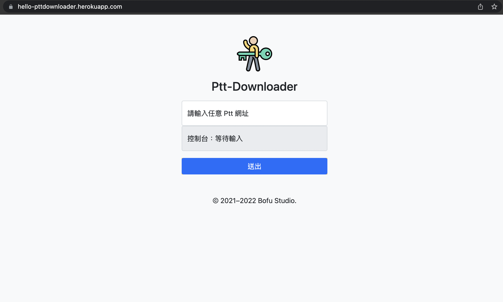

# [PttDownloader](https://hello-pttdownloader.herokuapp.com/) 
> 針對台灣網路社群論壇-批踢踢實業坊進行網頁內容爬蟲。設計功能為尋訪網頁中的圖片元素，逐一下載後再進行檔案壓縮，最後提供給Client端進行下載。主要使用技術以及服務包含Node.js、Express、Puppeteer、Bootstrap、Heroku。

## Usage 

[PttDownloader](https://hello-pttdownloader.herokuapp.com/)

## Release History

* 0.1.1
    * 調整細部功能

* 0.1.0
    * 新增控制台
    * 新增壓縮功能
* 0.0.1
    * 完成基本網頁版型

## Contact

Bofu – [@CakeResume](https://www.cakeresume.com/bofuchen) – bofusoci@gmail.com

